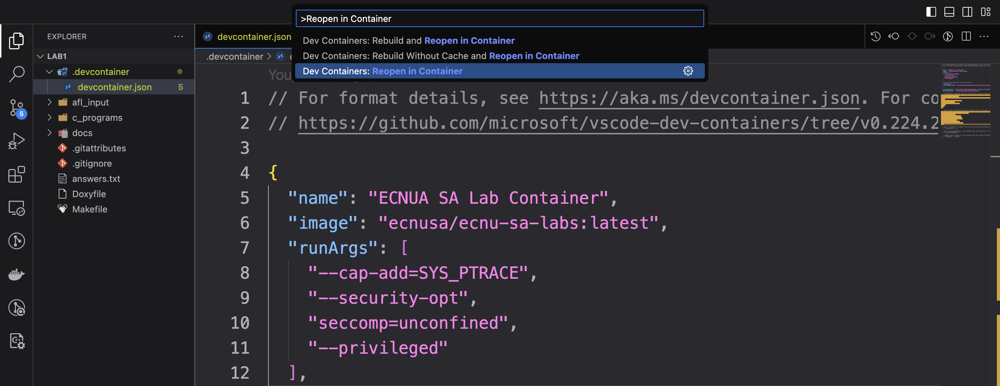

## Setting up Course Lab Environment

**Step1.** We will use Docker containers with VS Code to ensure everyone uses a consistent development environment for the labs in this course. Before proceeding, you need to install <a href="https://www.docker.com/">docker</a> on your local machine; we will refer to this machine as the host machine. 

**Step2.** After this, install <a href="https://code.visualstudio.com/Download">VS Code</a> and within VS Code install the <a href="https://code.visualstudio.com/docs/remote/remote-overview">Remote Development Extension</a>. 


**Step3.** For the course labs, we provide a configuration file(`.devcontainer/devcontainer.json`) in each lab that instructs VS Code how to set up a development environment using an appropriate docker image and various other configuration options. 

About `.devcontainer/devcontainer.json`,
```
"name": "ECNUA SA Lab Container",
"image": "ecnusa/ecnu-sa-labs:latest",
"runArgs": [
	"--cap-add=SYS_PTRACE",
	"--security-opt",`
	"seccomp=unconfined",
	"--privileged"
],

// Set the env-variables for the container.
"remoteEnv": {
	"LD_LIBRARY_PATH": "${containerWorkspaceFolder}/build:${containerEnv:LD_LIBRARY_PATH}"
},
...
```

**Note: You will need to open the lab folder such as lab1 or lab2 in VS Code rather than the ecnu-sa-labs folder.**

**Step4.** To start working on a lab, open the lab inside VS Code. Press the F1 function key to open a search box (Note: Sometimes, it's not the F1 function key). Search and select Reopen in Container. This will reload VS Code and set up the development environment. You can now edit, run and debug your lab in VS Code. To resume working on a lab, open the lab in VS Code and Reopen in Container. Any changes you make here will be available in your ecnu-sa-labs folder.

When the F1 key work, you will see..



When the F1 key doesn't work, you can do the following:


